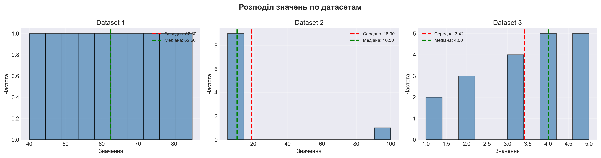
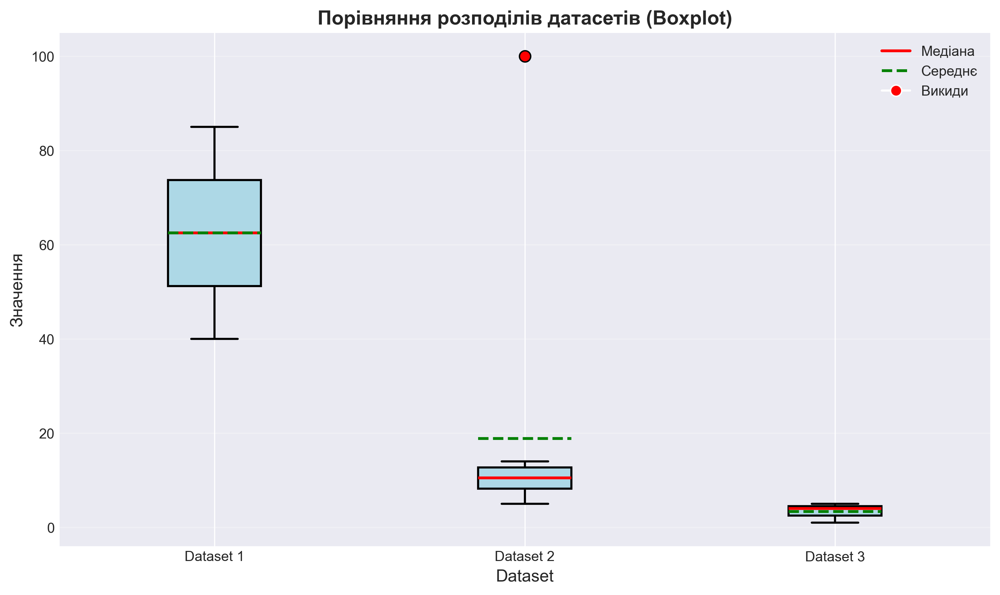

# Опис результатів Homework 1

## Візуалізації

### Гістограми розподілів

### Порівняльний Boxplot

## Аналіз датасетів

### Dataset 1
Середнє та медіана дорівнюють 62.5, тож розподіл симетричний. Відсутність моди означає, що усі значення унікальні. Стандартне відхилення 14.36 (коефіцієнт варіації 23 %) свідчить про помірне розсіювання навколо середнього, тож набір добре підходить для базових порівнянь без сильного впливу екстремальних значень.

### Dataset 2
Середнє 18.9 суттєво перевищує медіану 10.5 через наявність викиду 100, звідси виражена права асиметрія. Мода відсутня, тобто більшість значень з'являються по одному разу. Стандартне відхилення 27.16 (коефіцієнт варіації 143.7 %) показує дуже високу варіативність — аналізувати такий набір без обробки викидів ризиковано.

### Dataset 3
Середнє 3.42 нижче за медіану 4.0, що вказує на ліву асиметрію (надлишок менших значень). Мода має два піки — 4 та 5. Стандартне відхилення 1.31 (коефіцієнт варіації 38.3 %) означає відчутні, але контрольовані коливання. Набір придатний для описової статистики, проте треба враховувати кілька найбільш частих значень.
